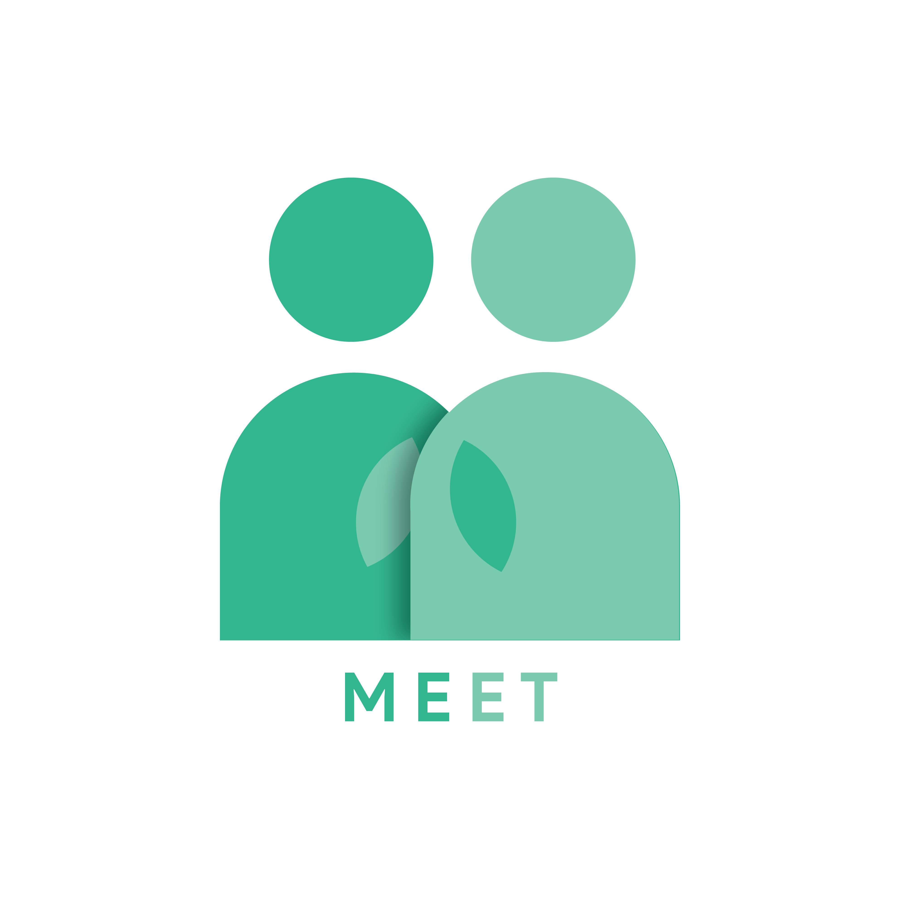
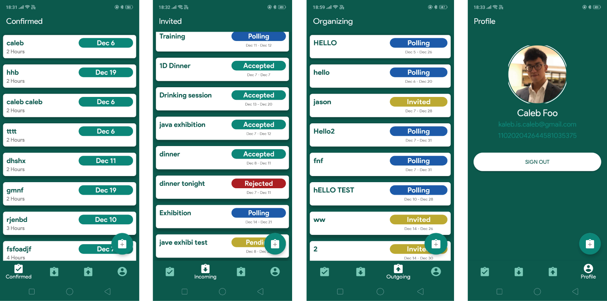
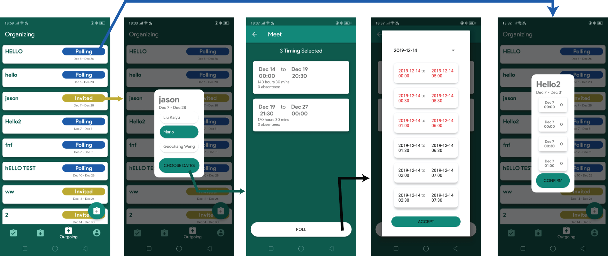
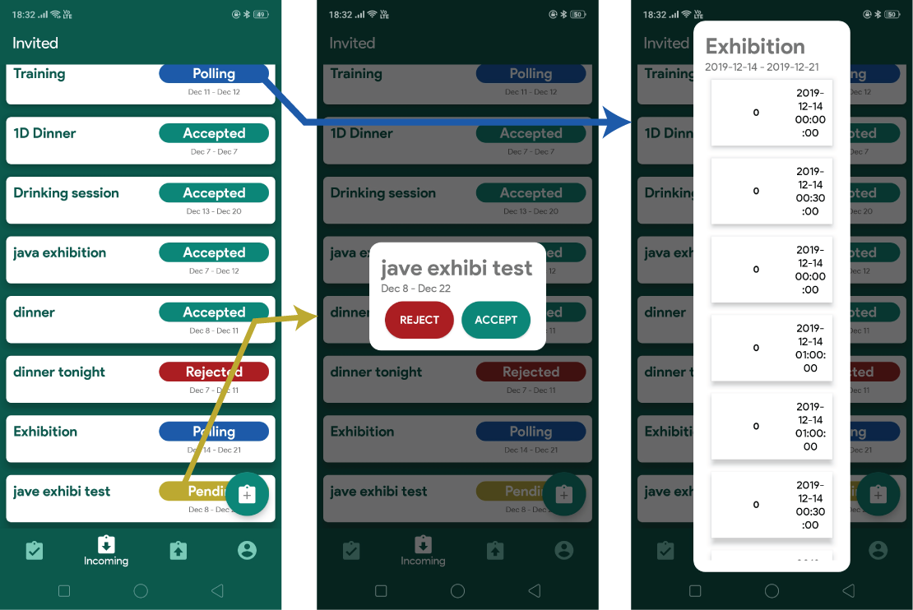
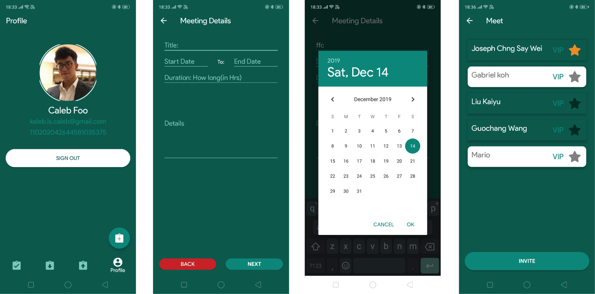

# MeetApp

- [MeetApp](#meetapp)
  - [ScreenShots](#screenshots)
  - [Architecture](#architecture)

 **Meeting Scheduler App that makes use of Google Calendar Api and Sign in**
*(Database Server may be down due to using GCP ($$$))*

 Feel free to use my architecture to build similar apps!

## ScreenShots

**Main Activity**

**Organizing Workflow**

**Incoming Workflow**

**Add New Event Workflow**

## Architecture

**System Architecture**

**DataBase Server & API**

[Link to Database Server & API Code](https://github.com/mjosephan2/meetBot/tree/master)